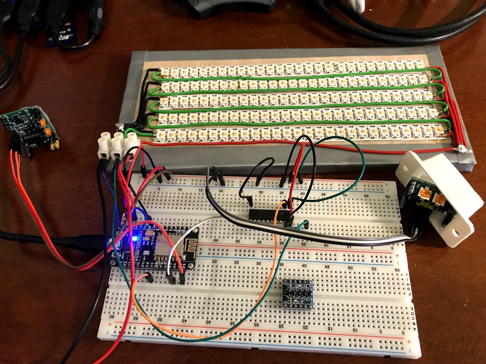

# Stair Light Project

Automatische, animierte Treppenbeleuchtung mit **SK6812 RGBW**-LEDs. Zwei PIR-Sensoren (SR-HC501) an erster und letzter Stufe erkennen die Laufrichtung und starten eine zufällige Animation. Steuerung per **Web-UI** (Treppenautomatik An/Aus, manuelle Farben, Animationen 10 s testen) und optional **Nachtmodus** (0–7 Uhr: nur rot, atmend).

- **MCU:** ESP8266 (z. B. NodeMCU)
- **LEDs:** SK6812 RGBW (kompatibel zu WS2812), 27 LEDs pro Stufe, 16 Stufen (konfigurierbar)
- **Sensoren:** PIR1 = „hoch“, PIR2 = „runter“
- **Start:** Treppenautomatik ist nach dem Boot **aus**; 3× grünes Blinken signalisiert „bereit“.



---

## Voraussetzungen

- **Arduino CLI** (z. B. `brew install arduino-cli`)
- **ESP8266-Core:**  
  `arduino-cli core update-index && arduino-cli core install esp8266:esp8266`
- **Bibliotheken:**  
  `arduino-cli lib install "Adafruit NeoPixel"`  
  `arduino-cli lib install "EasyNTPClient"`

---

## Projektstruktur

| Ordner/Datei | Beschreibung |
|--------------|--------------|
| `rgbw_stair_light/` | Haupt-Sketch (Treppenlicht + OTA) |
| `rgbw_stair_light/parking.h` | Animationen und Hilfsfunktionen |
| `rgbw_stair_light/birthdays.h.example` | Vorlage für Geburtstage (kopieren nach `birthdays.h`) |
| `minimal_ota/` | Minimal-Sketch nur WiFi + OTA (zum Testen) |
| `RGBWstrandtest/` | Separater LED-Strip-Test (ohne PIR) |
| `schematics/` | KiCad-Schaltplan, PCB |
| `images/` | Fotos (u. a. Testbett) |

**Skripte (im Projektroot):**

| Skript | Funktion |
|--------|----------|
| `upload-to-esp8266.sh` | Compile + Upload **per USB** |
| `upload-to-esp8266-ota.sh` | Compile + Upload **per OTA** (WiFi) |
| `upload-ota-firewall-ok.sh` | OTA mit **temporär ausgeschalteter Firewall** (macOS) |
| `upload-minimal-via-usb.sh` | Minimal-Sketch per USB flashen |
| `upload-minimal-ota.sh` | Minimal-Sketch per OTA flashen (Test) |
| `setup-firewall-ota.sh` | Firewall-Regel für OTA-Python setzen (macOS, sudo) |

---

## Einrichtung

### 1. WiFi und Hostname

Die Zugangsdaten liegen in **`rgbw_stair_light/credentials.h`** (wird von Git ignoriert).

- **Neu:** `credentials.h.example` nach `credentials.h` kopieren und anpassen:
  - `WIFI_SSID` – dein WLAN-Name  
  - `WIFI_PASS` – WLAN-Passwort  
  - `OTA_HOSTNAME` – z. B. `stairlight-testbed` oder `stairlight-treppe`

Ohne `credentials.h` bricht der Build ab. Für den Minimal-Sketch: `minimal_ota/credentials.h` anlegen (oder aus `rgbw_stair_light/` kopieren).

### 2. Geburtstage (optional)

An Tagen, die in **`rgbw_stair_light/birthdays.h`** eingetragen sind, läuft nur die Geburtstags-Animation.

- **`birthdays.h`** liegt in der `.gitignore` und wird nicht ins Repo committed.
- Vorlage: `birthdays.h.example` nach `birthdays.h` kopieren, `BIRTHDAY_COUNT` und die Liste `BIRTHDAY(Monat, Tag)` anpassen (z. B. `BIRTHDAY(3, 15)` = 15. März).
- Ohne `birthdays.h` bricht der Build ab – also nach dem Klonen die Example-Datei kopieren (bei Bedarf mit 0 Einträgen).

### 3. Firewall (macOS, nur bei OTA-Problemen)

Wenn OTA mit aktiver Firewall fehlschlägt:

- **Variante A – Regel per CLI:**    
  `sudo ./setup-firewall-ota.sh`  
  (erlaubt Arduino-Python und Terminal/Cursor eingehende Verbindungen)

- **Variante B – OTA mit kurz ausgeschalteter Firewall:**  
  `./upload-ota-firewall-ok.sh stairlight-testbed.local`  
  (Firewall wird nur während des Uploads aus- und danach wieder eingeschaltet)

---

## Erster Upload: per USB

1. ESP8266 per USB verbinden.
2. Port prüfen (optional):  
   `arduino-cli board list`
3. Im Projektordner ausführen:

   ```bash
   ./upload-to-esp8266.sh
   ```

   Standard-Port ist `/dev/cu.usbserial-0001`. Anderen Port angeben:

   ```bash
   ./upload-to-esp8266.sh /dev/cu.wchusbserial-12345
   ```

4. Nach erfolgreichem Upload verbindet sich der ESP mit dem WLAN und wartet auf OTA.

---

## Upload per OTA (WiFi)

Voraussetzung: Der ESP läuft bereits mit einer Firmware, die **ArduinoOTA** nutzt (z. B. nach dem ersten USB-Upload), und ist im gleichen WLAN.

- **Ziel per Hostname (mDNS):**  
  ```bash
  ./upload-to-esp8266-ota.sh stairlight-testbed.local
  ```

- **Ziel per IP:**  
  ```bash
  ./upload-to-esp8266-ota.sh 192.168.2.185
  ```

Die IP erscheint im Serial Monitor nach „Connected, IP address:“ bzw. „Web-Server: http://…“.

**Web-Steuerung:** Im Browser `http://<IP>` oder `http://<OTA_HOSTNAME>.local` öffnen.

- **Treppenautomatik** An/Aus (nach Boot standardmäßig Aus).
- **Manuelle Farben:** Pro Kanal (Rot, Grün, Blau, Weiss) −10 %, An/Aus, +10 % Helligkeit; Anzeige in %.
- **Alle LEDs aus.**
- **Animation (10 s):** Dropdown mit Zufallsfade, Regenbogen, Weiß aufdrehen, Sternenfunkeln, Geburtstag, **Nacht (Rot atmend)** – mit **Go** wird die gewählte Animation 10 Sekunden abgespielt (unabhängig von der Uhrzeit).

Das Frontend wird vom Browser gecacht; Aktionen laufen per API (GET State, POST für Aktionen). Webserver und OTA bleiben auch während laufender Animationen erreichbar.

**Wenn die Firewall (macOS) OTA blockiert:**  
Statt `upload-to-esp8266-ota.sh` das Wrapper-Skript nutzen:

```bash
./upload-ota-firewall-ok.sh stairlight-testbed.local
```

Damit wird die Firewall nur während des Uploads kurz deaktiviert und danach wieder aktiviert.

**Debug-Ausgabe von espota:**  
```bash
./upload-to-esp8266-ota.sh stairlight-testbed.local --debug
```

---

## Serial Monitor

Baudrate: **115200**.

- **Per Task (Cursor/VS Code):**  
  `Cmd+Shift+P` → „Tasks: Run Task“ → „Serial Monitor (115200 Baud)“ → Port eingeben.

- **Per Terminal:**  
  ```bash
  arduino-cli monitor -p /dev/cu.usbserial-0001 -c baudrate=115200
  ```

Port ggf. anpassen (`arduino-cli board list`). Beenden mit `Ctrl+C`. Während der Monitor läuft, ist der USB-Port belegt (kein Upload möglich).

**Hinweis:** Mit `USE_SERIAL.setDebugOutput(true)` (im Sketch) gibt die ESP8266-WiFi-Bibliothek zusätzlich Verbindungsmeldungen aus (`state:`, `reconnect`, `scandone` usw.). Bei stabilem WLAN kann man das mit `setDebugOutput(false)` abschalten, um nur PIR/NTP und eigene Meldungen zu sehen.

---

## Nachtmodus (0–7 Uhr)

Zwischen **0 und 7 Uhr Ortszeit** (NTP + `TIMEZONE_OFFSET_SEC`):

- Es läuft **nur** die **Nacht-Animation**: sanft atmendes Rot, max. 10 % Helligkeit, **geht nicht ganz aus** (Mindesthelligkeit konfigurierbar).
- PIR und manuelle Web-Farben haben keine Wirkung.
- Ab 7 Uhr schaltet der Strip aus und das normale Verhalten (Automatik/Manual) gilt wieder.

Die gleiche „Nacht (Rot atmend)“-Animation kann jederzeit im Web unter **Animation (10 s)** → **Go** für 10 Sekunden getestet werden.

---

## Konfiguration im Sketch

In **`rgbw_stair_light/rgbw_stair_light.ino`** (bzw. `parking.h`):

| Konstante | Bedeutung | Standard |
|-----------|------------|----------|
| `STEPS` | Anzahl Stufen | 16 |
| `WIDTH` | LEDs pro Stufe | 27 |
| `ANIM_DURATION` | Dauer einer PIR-Animation (ms) | 20000 |
| `POST_ANIM_DELAY_MS` | Pause nach Animation bis zur nächsten Reaktion (ms) | 10000 |
| `BRIGHTNESS` | LED-Helligkeit 0–255 | 255 |
| `DEBUG` | 1 = PIR/Trigger im Serial Monitor | 1 |
| `TIMEZONE_OFFSET_SEC` | Sekunden UTC→Ortszeit (z. B. 3600 für CET) | 3600 |
| `NIGHT_HOUR_START` / `NIGHT_HOUR_END` | Nachtmodus von Stunde … bis (exkl.) | 0, 7 |
| `NIGHT_BRIGHTNESS_MAX` / `NIGHT_BRIGHTNESS_MIN` | Rot im Nachtmodus max./min. (0–255) | 25, 5 |

Pins (laut Kommentar im Sketch): NeoPixel = GPIO 14 (D5), PIR1 = GPIO 16 (D0), PIR2 = GPIO 4 (D2). GPIO 15 und 2 nicht verwenden (Boot-Verhalten).

---

## Minimal-OTA-Test

Zum Prüfen, ob OTA grundsätzlich funktioniert (ohne vollen Sketch):

1. Minimal-Sketch per USB flashen:  
   `./upload-minimal-via-usb.sh`
2. OTA des Minimal-Sketches testen:  
   `./upload-minimal-ota.sh stairlight-testbed.local --debug`

Wenn das durchläuft, OTA funktioniert; Probleme beim vollen Sketch können z. B. an Speicher oder Firewall liegen.

---

## Animationen

Die Richtung (hoch/runter) wird über PIR1/PIR2 erkannt. Bei eingeschalteter Treppenautomatik wird zufällig eine der folgenden Animationen gestartet (ohne direkte Wiederholung):

- **Zufallsfade** (`simpleFadeToRandom`) – Stufen nacheinander in Zufallsfarbe ein-/ausblenden  
- **Regenbogen** (`rainbowSteps`) – Regenbogen pro Stufe, dann Lauf  
- **Weiß aufdrehen** (`FadeToFullBrightness`) – alle Stufen auf Weiß  
- **Sternenfunkeln** (`starSparkle`) – dunkelblauer Hintergrund mit weißen „Sternen“

An **Geburtstagen** (laut `birthdays.h`) läuft nur die **Geburtstags-Animation** (bunte Zufallsfarben, 50 % Helligkeit).

Im Web unter **Animation (10 s)** können alle genannten plus **Nacht (Rot atmend)** für 10 Sekunden per „Go“ getestet werden.

Weitere Funktionen und mögliche neue Animationen stehen in **`parking.h`**.

---

## Lizenz / Kontakt

Ursprünglich ab Oktober 2016; Sketch und Struktur mehrfach erweitert (u. a. OTA, Credentials, Web-API, Nachtmodus, Geburtstage, Firewall-Workaround).

Bei Fragen oder Ideen für neue Animationen: Repository-Inhaber kontaktieren.
