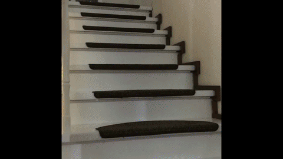

# Stair Light Project

Automatic animated stair lighting with **SK6812 RGBW** LEDs. Two PIR sensors (SR-HC501) at the first and last step detect direction and trigger a random animation. Control via **web UI** (stair automation on/off, manual colours, 10 s animation test) and optional **night mode** (0–7 h: red only, breathing).

- **MCU:** ESP8266 (e.g. NodeMCU)
- **LEDs:** SK6812 RGBW (WS2812-compatible), 27 LEDs per step, 16 steps (configurable)
- **Sensors:** PIR1 = “up”, PIR2 = “down”
- **Boot:** Stair automation is **off** after boot; 3× green blink indicates “ready”.



---

## Requirements

- **Arduino CLI** (e.g. `brew install arduino-cli`)
- **ESP8266 core:**  
  `arduino-cli core update-index && arduino-cli core install esp8266:esp8266`
- **Libraries:**  
  `arduino-cli lib install "Adafruit NeoPixel"`  
  `arduino-cli lib install "EasyNTPClient"`

---

## Project structure

| Folder/File | Description |
|-------------|-------------|
| `rgbw_stair_light/` | Main sketch (stair light + OTA) |
| `rgbw_stair_light/parking.h` | Animations and helpers |
| `rgbw_stair_light/birthdays.h.example` | Template for birthdays (copy to `birthdays.h`) |
| `minimal_ota/` | Minimal sketch (WiFi + OTA only, for testing) |
| `RGBWstrandtest/` | Separate LED strip test (no PIR) |
| `schematics/` | KiCad schematic, PCB |
| `images/` | Photos (incl. test bed) |

**Scripts (project root):**

| Script | Purpose |
|--------|---------|
| `upload-to-esp8266.sh` | Compile + upload **via USB** |
| `upload-to-esp8266-ota.sh` | Compile + upload **via OTA** (WiFi) |
| `upload-ota-firewall-ok.sh` | OTA with **firewall temporarily disabled** (macOS) |
| `upload-minimal-via-usb.sh` | Flash minimal sketch via USB |
| `upload-minimal-ota.sh` | Flash minimal sketch via OTA (test) |
| `setup-firewall-ota.sh` | Add firewall rule for OTA (macOS, sudo) |

---

## Setup

### 1. WiFi and hostname

Credentials go in **`rgbw_stair_light/credentials.h`** (gitignored).

- Copy `credentials.h.example` to `credentials.h` and set:
  - `WIFI_SSID` – your Wi‑Fi name  
  - `WIFI_PASS` – Wi‑Fi password  
  - `OTA_HOSTNAME` – e.g. `stairlight-testbed` or `stairlight`

Without `credentials.h` the build fails. For the minimal sketch: create `minimal_ota/credentials.h` (or copy from `rgbw_stair_light/`).

### 2. Birthdays (optional)

On dates listed in **`rgbw_stair_light/birthdays.h`**, only the birthday animation runs.

- **`birthdays.h`** is in `.gitignore` and is not committed.
- Copy `birthdays.h.example` to `birthdays.h`, set `BIRTHDAY_COUNT` and the `BIRTHDAY(month, day)` list (e.g. `BIRTHDAY(3, 15)` = 15 March).
- Without `birthdays.h` the build fails – after cloning, copy the example (use 0 entries if you don’t need birthdays).

### 3. Firewall (macOS, only if OTA fails)

If OTA fails with the firewall on:

- **Option A – rule via CLI:**  
  `sudo ./setup-firewall-ota.sh`  
  (allows Arduino Python and Terminal/Cursor to accept incoming connections)

- **Option B – OTA with firewall briefly off:**  
  `./upload-ota-firewall-ok.sh stairlight-testbed.local`  
  (firewall is disabled only during the upload, then re-enabled)

---

## First upload: via USB

1. Connect the ESP8266 via USB.
2. Check port (optional):  
   `arduino-cli board list`
3. From the project folder run:

   ```bash
   ./upload-to-esp8266.sh
   ```

   Default port is `/dev/cu.usbserial-0001`. To use another port:

   ```bash
   ./upload-to-esp8266.sh /dev/cu.wchusbserial-12345
   ```

4. After a successful upload the ESP connects to Wi‑Fi and is ready for OTA.

---

## Upload via OTA (WiFi)

Prerequisite: the ESP is already running firmware with **ArduinoOTA** (e.g. after the first USB upload) and is on the same Wi‑Fi network.

- **By hostname (mDNS):**  
  ```bash
  ./upload-to-esp8266-ota.sh stairlight-testbed.local
  ```

- **By IP:**  
  ```bash
  ./upload-to-esp8266-ota.sh 192.168.2.185
  ```

The IP is shown in the serial monitor after “Connected, IP address:” or “Web-Server: http://…”.

**Web UI:** Open `http://<IP>` or `http://<OTA_HOSTNAME>.local` in a browser.

- **Stair automation** on/off (off by default after boot).
- **Manual colours:** Per channel (red, green, blue, white): −10%, on/off, +10% brightness; value shown in %.
- **All LEDs off.**
- **Animation (10 s):** Dropdown with Random fade, Rainbow, White ramp, Star sparkle, Birthday, **Night (red breathing)** – use **Go** to run the selected animation for 10 seconds (any time of day).

The frontend is cached by the browser; actions use the API (GET state, POST for actions). Web server and OTA stay available during animations.

**If the firewall (macOS) blocks OTA:**  
Use the wrapper script instead of `upload-to-esp8266-ota.sh`:

```bash
./upload-ota-firewall-ok.sh stairlight-testbed.local
```

The firewall is then disabled only during the upload and re-enabled afterwards.

**espota debug output:**  
```bash
./upload-to-esp8266-ota.sh stairlight-testbed.local --debug
```

---

## Serial monitor

Baud rate: **115200**.

- **Via task (Cursor/VS Code):**  
  `Cmd+Shift+P` → “Tasks: Run Task” → “Serial Monitor (115200 Baud)” → enter port.

- **Via terminal:**  
  ```bash
  arduino-cli monitor -p /dev/cu.usbserial-0001 -c baudrate=115200
  ```

Adjust the port if needed (`arduino-cli board list`). Exit with `Ctrl+C`. While the monitor is running the USB port is in use (no upload).

**Note:** With `USE_SERIAL.setDebugOutput(true)` in the sketch, the ESP8266 WiFi library also prints connection messages (`state:`, `reconnect`, `scandone`, etc.). For a quieter monitor you can set `setDebugOutput(false)` to see only PIR/NTP and your own messages.

---

## Night mode (0–7 h)

Between **0:00 and 7:00 local time** (NTP + `TIMEZONE_OFFSET_SEC`):

- Only the **night animation** runs: soft breathing red, max 10% brightness, **never fully off** (minimum brightness is configurable).
- PIR and manual web colours have no effect.
- After 7:00 the strip turns off and normal behaviour (automation/manual) applies again.

The same “Night (red breathing)” animation can be tested anytime in the web UI under **Animation (10 s)** → **Go** for 10 seconds.

---

## Sketch configuration

In **`rgbw_stair_light/rgbw_stair_light.ino`** (and `parking.h`):

| Constant | Meaning | Default |
|----------|---------|---------|
| `STEPS` | Number of steps | 16 |
| `WIDTH` | LEDs per step | 27 |
| `ANIM_DURATION` | Duration of a PIR-triggered animation (ms) | 20000 |
| `POST_ANIM_DELAY_MS` | Delay after animation before next trigger (ms) | 10000 |
| `BRIGHTNESS` | LED brightness 0–255 | 255 |
| `DEBUG` | 1 = PIR/trigger on serial monitor | 1 |
| `TIMEZONE_OFFSET_SEC` | Seconds UTC→local (e.g. 3600 for CET) | 3600 |
| `NIGHT_HOUR_START` / `NIGHT_HOUR_END` | Night mode from hour … to (excl.) | 0, 7 |
| `NIGHT_BRIGHTNESS_MAX` / `NIGHT_BRIGHTNESS_MIN` | Red in night mode max/min (0–255) | 25, 5 |

Pins (see comments in sketch): NeoPixel = GPIO 14 (D5), PIR1 = GPIO 16 (D0), PIR2 = GPIO 4 (D2). Do not use GPIO 15 and 2 (boot behaviour).

---

## Minimal OTA test

To check that OTA works at all (without the full sketch):

1. Flash the minimal sketch via USB:  
   `./upload-minimal-via-usb.sh`
2. Test OTA of the minimal sketch:  
   `./upload-minimal-ota.sh stairlight-testbed.local --debug`

If that works, OTA is fine; issues with the full sketch may be due to memory or firewall.

---

## Animations

Direction (up/down) is detected via PIR1/PIR2. With stair automation on, a random one of these animations runs (no back-to-back repeat):

- **Random fade** (`simpleFadeToRandom`) – steps fade in/out in a random colour  
- **Rainbow** (`rainbowSteps`) – rainbow per step, then run  
- **White ramp** (`FadeToFullBrightness`) – all steps to white  
- **Star sparkle** (`starSparkle`) – dark blue background with white “stars”

On **birthdays** (from `birthdays.h`) only the **birthday animation** runs (random colours, 50% brightness).

In the web UI under **Animation (10 s)** you can test all of the above plus **Night (red breathing)** for 10 seconds with “Go”.

More functions and possible new animations are in **`parking.h`**.

---

## License / contact

Originally from October 2016; sketch and structure have been extended (OTA, credentials, web API, night mode, birthdays, firewall workaround).

For questions or ideas for new animations, contact the repository owner.
